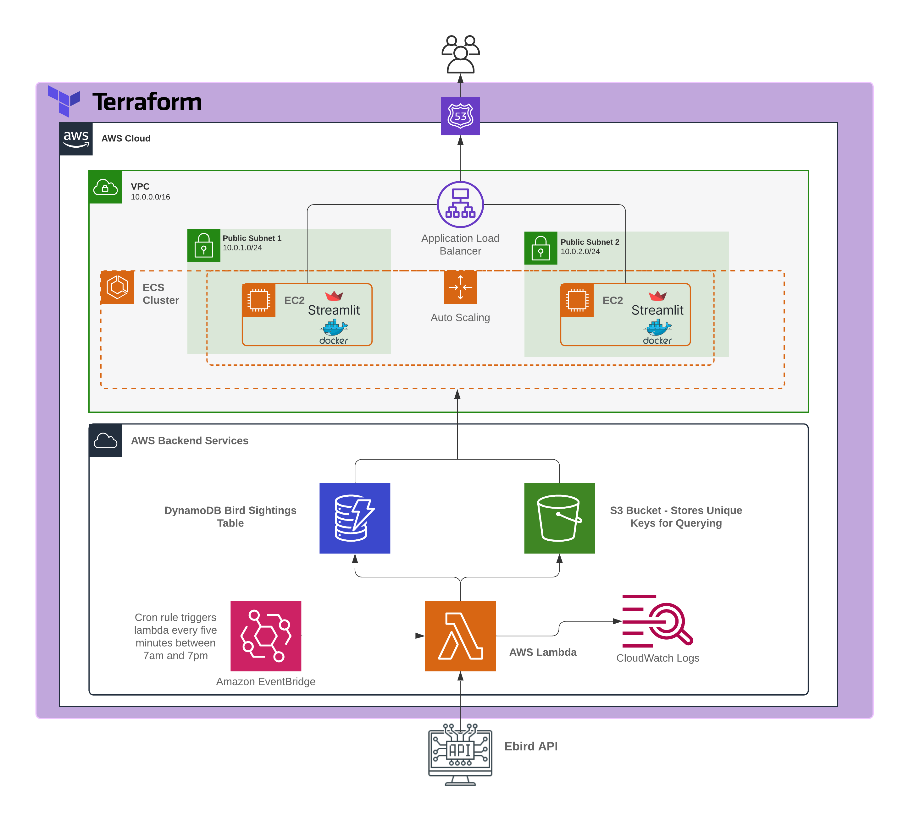
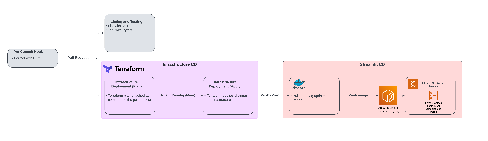

# Bird Sighting Tracker for the DC, Maryland, Virginia (DMV) Area
- [Overview](#overview)
- [Tech Stack](#tech-stack)
- [Data Architecture](#data-architecture)
- [CI/CD](#continuous-integrationcontinuous-deployment)

## Overview
This repository contains the code to build and deploy a Streamlit web app tracking bird sightings in the DMV area. Bird sightings are extracted from the [ebird API](https://documenter.getpostman.com/view/664302/S1ENwy59), a project of the Cornell Lab of Ornithology. The web application and associated backend services are hosted on AWS and continuous deployment is handled via Github Actions. Sightings are represented geospatially in the web app. Data on bird sightings is updated every five minutes and is stored for fourteen days. 

The Streamlit web app is located here: [Streamlit App](https://bird-sightings.sethltaylor.dev/). 

This app will be periodically updated with new features to continue practicing data engineering skills. 

## Tech Stack
- [Streamlit](https://streamlit.io/): Web app framework used for visualizing the bird sightings. 
- [AWS Lambda](https://aws.amazon.com/lambda/): Serverless compute running Python functions to extract and load data on sightings from the ebird API.
- [AWS DynamoDB](https://aws.amazon.com/dynamodb/): NoSQL database to store sighting information with fast reads and writes. 
- [AWS S3](https://aws.amazon.com/s3/): Storage for unique keys in DynamoDB table to support querying, and storage for Lambda function deployment package. 
- [AWS Elastic Container Service](https://aws.amazon.com/ecs/): Management of the Streamlit docker containers as a service. 
- [AWS EC2](https://aws.amazon.com/ec2/): Servers to run the docker containers. 
- [AWS EventBridge](https://aws.amazon.com/eventbridge/): Cron scheduling for the Lambda function. 
- [Terraform](https://www.terraform.io/): Used for managing AWS infrastructure as code. 

## Data Architecture

- All AWS infrastructure is managed as code via Terraform. 
- Data is retrieved from the eBird API via a Python Lambda function. EventBridge is used to schedule the function to execute every five minutes from 7am to 7pm. 
    - The Lambda function batch writes JSON data on sightings as key-value pairs to DynamoDB with partition (bird common name) and sort keys (unique eBird subscriber ID) structured to ensure all unique sightings are captured while retaining efficient querying. 
    - The Lambda function also stores a unique set of keys in S3 as a CSV, which is retrieved in the Streamlit app to populate map filters and support querying of the DynamoDB table. 
- The web app is written as a Streamlit app and deployed as a Docker container to AWS Elastic Container Registry. AWS Elastic Container Service manages the deployment of the docker container as a service on EC2 servers. 
    - The web app allows users to query the DynamoDB table based on common bird name and filter sightings based on date. Sightings are visualized spatially. 
- The EC2 servers are deployed in public subnets inside a VPC, and are managed as part of an autoscaling group. 
    - An Application Load Balancer (ALB) is placed in front of the pubic subnets to distribute load across the servers. 
    - The ALB's DNS name is pointed to a private domain hosted on AWS Route 53, and the ALB forwards HTTP and HTTPS traffic to the exposed port on the Docker container, allowing public access to the Streamlit web app. 

## Continuous Integration/Continuous Deployment 

CI/CD is managed via Github Actions and focused on ensuring that code is formatted and tested, infrastructure is deployed via Terraform in line with pull requests to prevent infrastructure drift, and new versions of the Streamlit web app are deployed to ECS. 

- A pre-commit hook formats Python code using [Ruff](https://docs.astral.sh/ruff/), a fast Python linter and code formatter written in Rust. 
- On a pull request to develop or main branches, Python code is linted with Ruff and tested with Pytest. 
- Additionally, a Github Action executes the "terraform plan" command, which shows all changes that will be applied to the AWS infrastructure and attaches the plan as a comment to the PR, allowing insight into changes before they are applied. 
    - When the PR is merged, Terraform applies all changes to the AWS infrastructure via execution of the "terraform apply" command in Github Actions. 
- On a push to main, a Github Action builds a new Docker image of the streamlit app and pushes it to the AWS Elastic Container Registry. 
    - The Github Action then triggers a new deployment of the ECS task, which tears down the old docker container running the Streamlit web app and deploys a new one with the updated image. 